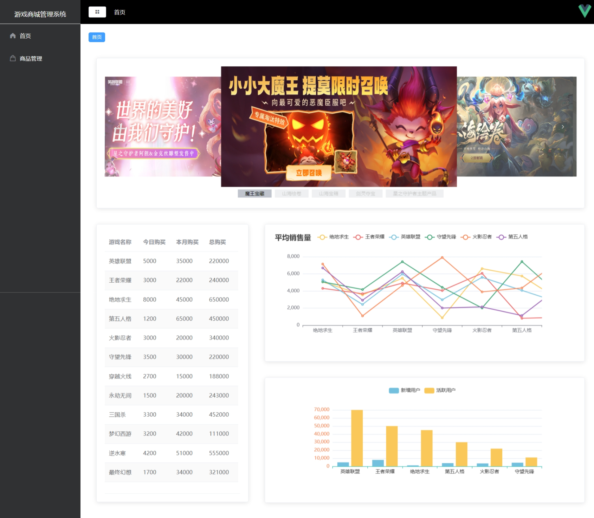

# Mall

#### 介绍
使用vue2框架构建的游戏商城管理系统

#### 软件架构
vue2框架、echarts、element-ui、mock等

#### 安装教程
VScode 1.79.2版本及以上

#### 主要界面

1.  后台管理界面首页，能够对轮播窗口进行增加和删除，以及echarts图表展示

2.  后台管理界面商品管理，能够对商品进行增加和删除，能够选择商品并实时显示价格

3. 后台管理界面用户管理，能够查询、增加、编辑、删除用户信息

4、用户首页界面，展示轮播效果但是无法修改

5、用户商品管理，展示商品并能够进行选择但是无法修改商品

